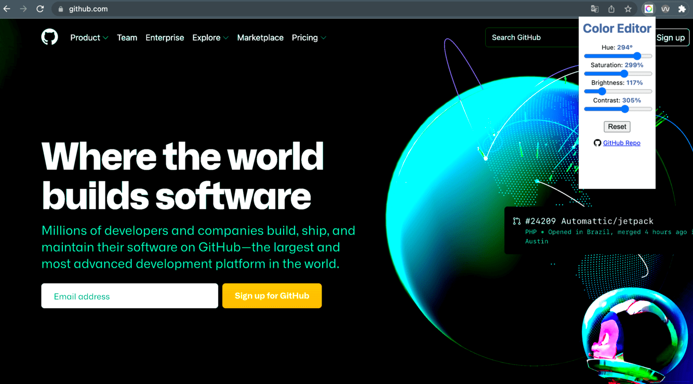
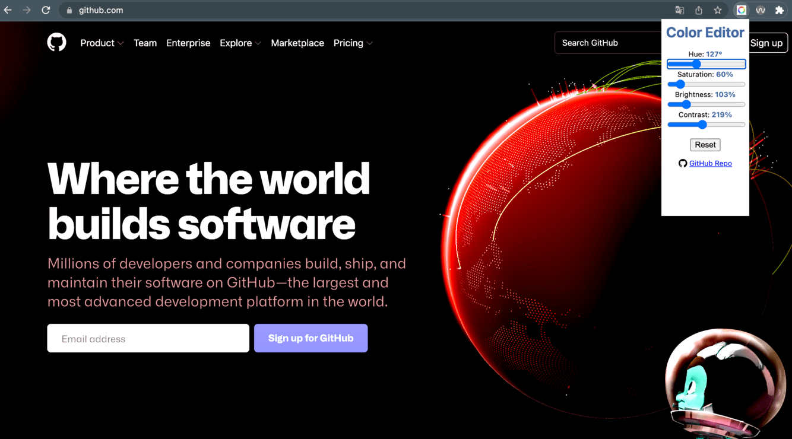

# ColorExtension

Chrome extension to change hue, saturation, brightness and contrast of the entire web page.

# Screenshots

    
    
    

# Installation

Manually install the extension on chrome or firefox browser.
Typically in the dedicated extensions menu.

# Authors

- [@ioa97](https://github.com/iota97)
- [@TheoMadCo](https://github.com/TheoMadCo)

